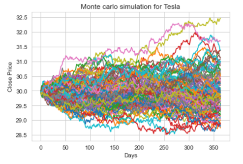
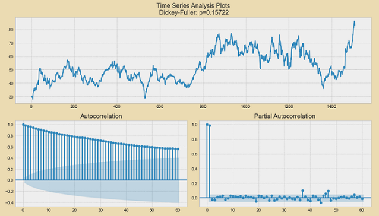

# Tesla-Stock-Price-prediction
Using Time - Series Analysis predicting Tesla Stock Closing price

# Objective

The objective in this project was to calculate Closing price of Tesla Stock using Time Series Analysis

# Dataset

The dataset used consists of closing price of Tesla stock for 5 years. It has following features-

* Date of Stock exchange
* Opening Price of the Stock
* Highest and Lowest Price of the stock
* Closing Price
* Volume Traded

 

# Data visualization

In this process we need to identify the lag parameters which may show charaterstic correlation.

* We can see that daily fluctuation of this stock is 15%
* Daily fluctuation of stock normal distribution is between +-2 %

# Applying Monte Carlo Simulation

* A Monte Carlo simulation is a model used to predict the probability of different outcomes when the intervention of random variables is present.
* Monte Carlo simulations help to explain the impact of risk and uncertainty in prediction and forecasting models.
* A variety of fields utilize Monte Carlo simulations, including finance, engineering, supply chain, and science.
* The basis of a Monte Carlo simulation involves assigning multiple values to an uncertain variable to achieve multiple results and then to average the results to obtain an estimate.
* Monte Carlo simulations assume perfectly efficient markets.

365 days prediction based on Monte-Carlo Simulation

# Series Stationary Analysis

In statistics, the Dickey–Fuller test tests the null hypothesis that a unit root is present in an autoregressive model. 
The alternative hypothesis is different depending on which version of the test is used, but is usually stationarity or trend-stationarity.

Shifting the series and creating lag values, we can see the series is stationary.

# Statistical Model- SARIMAX (The Seasonal Autoregressive Integrated Moving Average eXogenous Model)

* The SARIMAX is the seasonal equivalent of the ARIMAX model.
* Seasonal models help capture patterns which aren’t ever-present but appear periodically.
* The first 3 of these 4 orders are just seasonal versions of the ARIMA orders.
* A seasonal autoregressive order denoted by upper-case P, an order of seasonal integration denoted by upper-case D, and a seasonal moving average order signified 
by upper-case Q.

# Prediction through SARIMAX model

